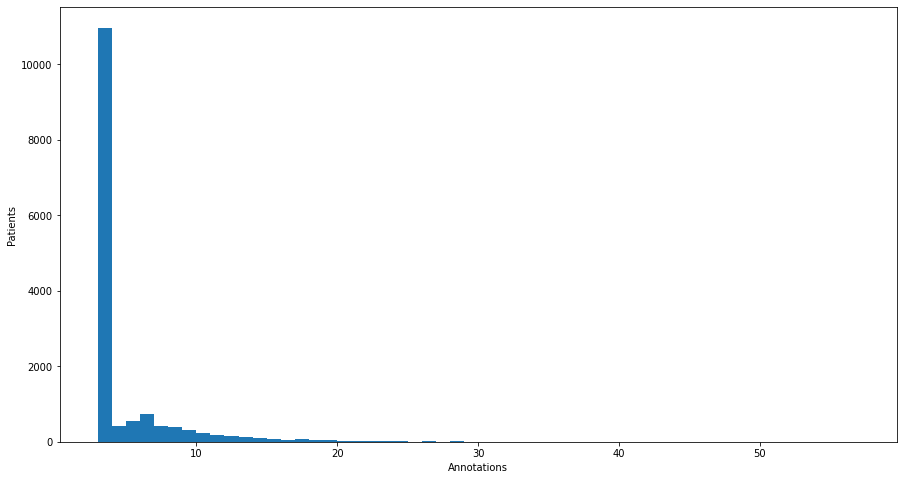
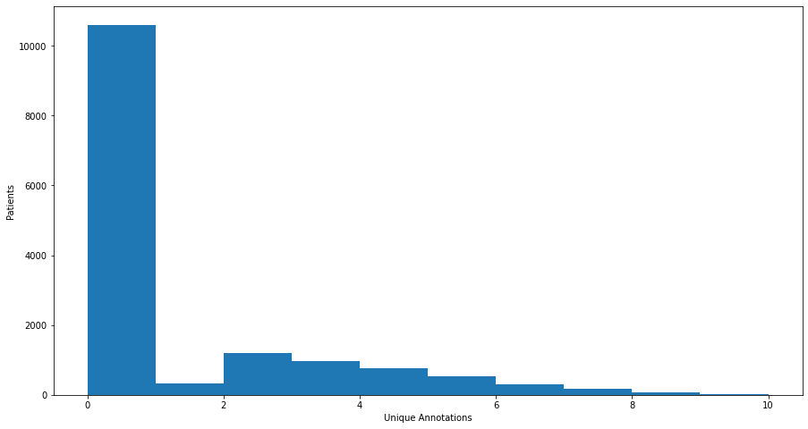
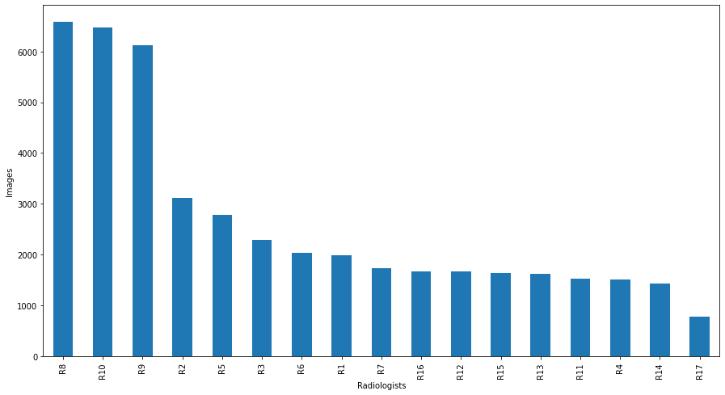
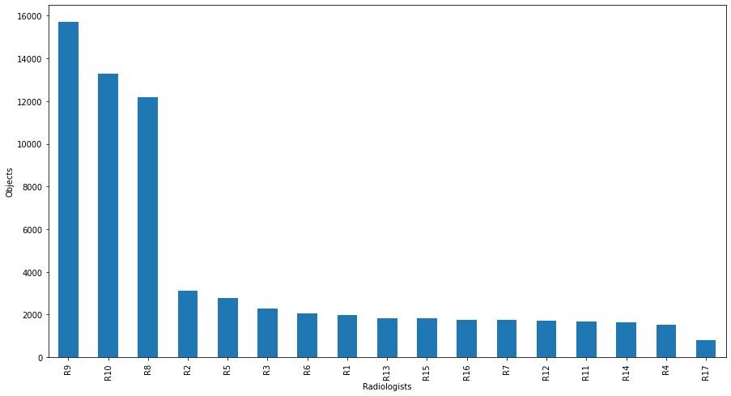
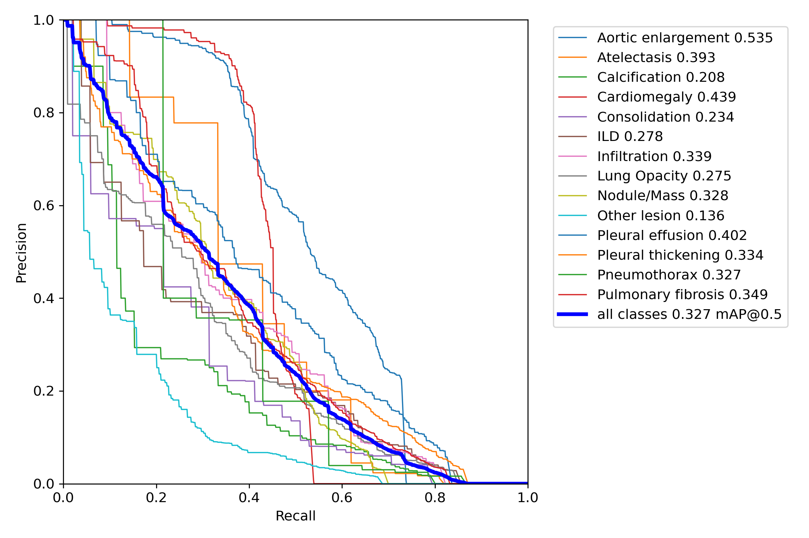
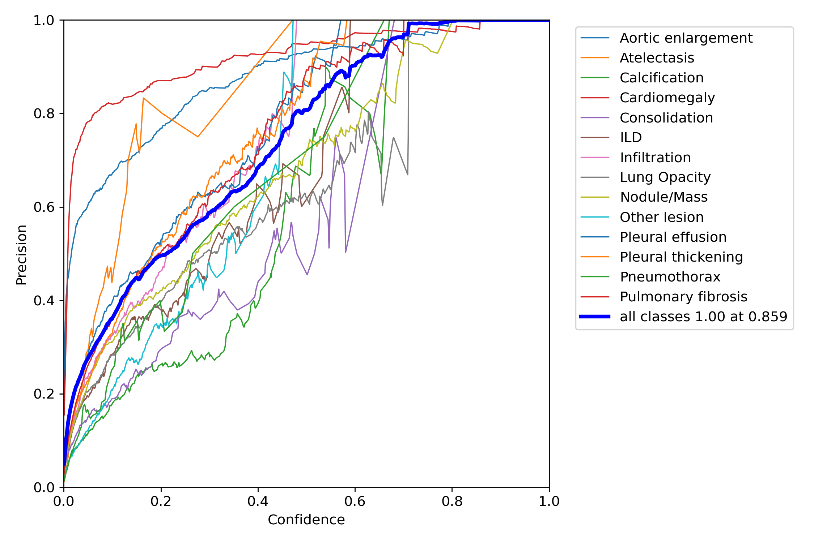
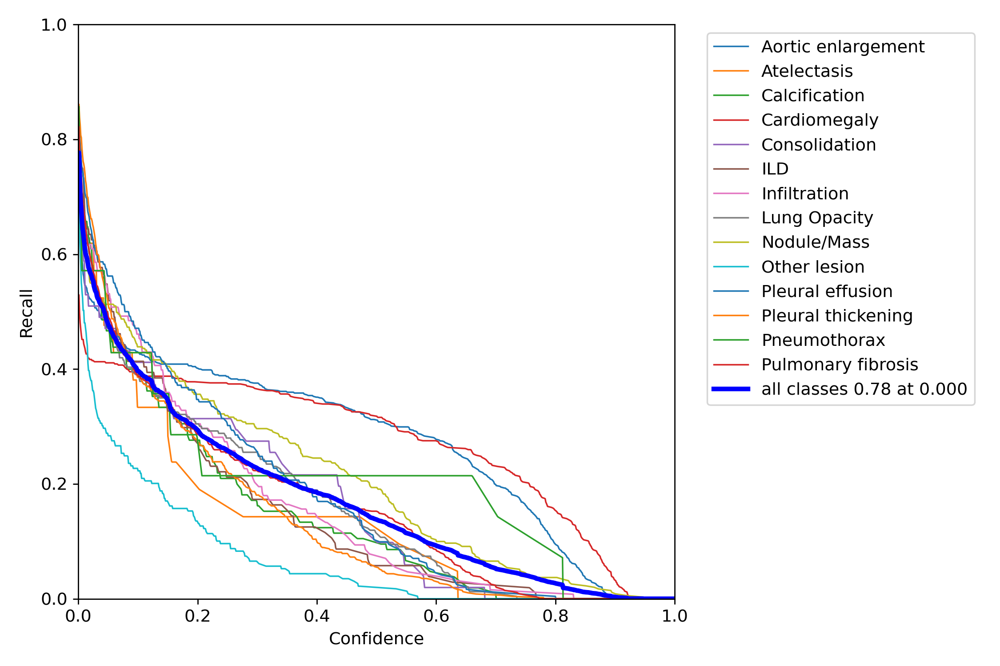

Using YOLOv7 Architecture for X-ray Object Detection
==============================
This is a submission of the **Term Project** for the **CIS735** course.

It contains the code necessary to implement the YOLOv7 algorithm for disease detection on X-ray screening images.

The following datasets have been used:

* [VinBigData Chest X-ray Abnormalities Detection](https://www.kaggle.com/competitions/vinbigdata-chest-xray-abnormalities-detection), a competition which transpired in the early 2021
* [VinBigData Chest X-ray Resized PNG (1024x1024)](https://www.kaggle.com/datasets/xhlulu/vinbigdata-chest-xray-resized-png-1024x1024), based on the previous dataset, the images' resolution were standardized to 1024x1024

Getting Started
------------
Clone the project from GitHub

`$ git clone https://github.com/tariqshaban/yolov7-vinbigdata-chest-x-ray.git`

Ensure that you have a Kaggle API key, Kaggle dataset importing requires an API key to be acquired,
see [Kaggle public API](https://www.kaggle.com/docs/api).

No further configuration is required.

Usage
------------
Navigate to the bottom of the notebook and invoke the following methods:

``` python
# Ready the dataset and partition it into training and validation folders.
# :return: Two datasets, one raw and another preprocessed
prime_dataset() -> List[pd.DataFrame]

# Conducts preliminary exploratory methods.
# :param pd.Dataframe df_raw: Specify the source dataframe (without modifications)
# :param pd.Dataframe df_preprocessed: Specify the preprocessed dataframe (with modifications)
# :param bool show_dataframe: Specify whether to show a sample from the dataframe or not
# :param bool show_image_sample: Specify whether to display a sample image from each class or not
# :param bool show_annotations_per_patient: Specify whether to plot the distribution of the number of objects detected in patients or not
# :param bool show_unique_annotations_per_patient: Specify whether to plot the distribution of the unique number of objects detected in patients or not
# :param bool show_class_distribution: Specify whether to plot the distribution of each class or not
# :param bool show_radiologist_objects_distribution: Specify whether to plot the distribution of the number of objects annotated by each radiologist or not
# :param bool show_radiologist_images_distribution: Specify whether to plot the distribution of the number of images handled by each radiologist or not
explore_dataset(
    df_raw: pd.Dataframe,
    df_preprocessed: pd.Dataframe,
    show_dataframe: bool = True, 
    show_image_sample: bool = True, 
    show_annotations_per_patient: bool = True, 
    show_unique_annotations_per_patient: bool = True, 
    show_class_distribution: bool = True, 
    show_radiologist_objects_distribution: bool = True, 
    show_radiologist_images_distribution: bool = True
)

# Builds the model, and exports a PyTorch model.
# :param bool visualize: Specify whether to carry out the evaluation metrics on the created model or not (show plots containing multiple evaluation metrics, including the confusion matrix and the precision-recall curve)
# :param bool export_as_onnx: Specify whether to export the model in a notation that is interpretable by ONNX or not
# :param bool export_as_tf: Specify whether to export the model in a notation that is interpretable by TensorFlow or not, ignores export_as_onnx value when set to True
# :param bool export_as_tflite: Specify whether to export the model in a notation that is interpretable by TensorFlow and optimized on edge devices or not, ignores export_as_onnx and export_as_tf values when set to True
build_model(
    visualize: bool = True,
    export_as_onnx: bool = True,
    export_as_tf: bool = True,
    export_as_tflite: bool = True,
)
```

> **Warning**: Remember to obtain a Kaggle API key as a JSON file.

> **Note**: If there is adequate computational power, the batch_size should be increased.

Dataset Exploration
--------

The following dataframe denotes a sample of the `train.csv` (from [VinBigData Chest X-ray Abnormalities Detection](https://www.kaggle.com/competitions/vinbigdata-chest-xray-abnormalities-detection)), it contains:

* `image_id`: Denotes the filename of the image, it should be noted that it is common to see redundant records of the 
  same image_id, which is expected; since each patient could have multiple diseases, also, an image can be reviewed by 
  more than one radiologist
* `class_name`: Specify whether there is a disease detected or not. If the same image contains, it should be added as a 
  new record rather than concatenating it using a delimiter
* `class_id`: Discrete representation of ID for the class_name
* `rad_id`: Identifier of the radiologist, multiple radiologists can review the same image
* `x_min`: x-axis value of the bottom-left point
* `y_min`: y-axis value of the bottom-left point
* `x_max`: x-axis value of the top-right point
* `y_max`: y-axis value of the top-right point

|             image_id             |     class_name     | class_id | rad_id | x_min | y_min | x_max | y_max |
|:--------------------------------:|:------------------:|:--------:|:------:|:-----:|:-----:|:-----:|:-----:|
| 50a418190bc3fb1ef1633bf9678929b3 |     No finding     |    14    |  R11   |  nan  |  nan  |  nan  |  nan  |
| 21a10246a5ec7af151081d0cd6d65dc9 |     No finding     |    14    |   R7   |  nan  |  nan  |  nan  |  nan  |
| 9a5094b2563a1ef3ff50dc5c7ff71345 |    Cardiomegaly    |    3     |  R10   |  691  | 1375  | 1653  | 1831  |
| 051132a778e61a86eb147c7c6f564dfe | Aortic enlargement |    0     |  R10   | 1264  |  743  | 1611  | 1019  |
| 063319de25ce7edb9b1c6b8881290140 |     No finding     |    14    |  R10   |  nan  |  nan  |  nan  |  nan  |

The following dataframe denotes a sample of the `train_meta.csv` (from [VinBigData Chest X-ray Resized PNG (1024x1024)](https://www.kaggle.com/datasets/xhlulu/vinbigdata-chest-xray-resized-png-1024x1024)), it contains:

* `image_id`: Denotes the filename of the image
* `dim0`: Denotes the height *(can be confusing; dim0 should have been represented as the width)*
* `dim1`: Denotes the width

|             image_id             |  dim0  |  dim1  |
|:--------------------------------:|:------:|:------:|
| 4d390e07733ba06e5ff07412f09c0a92 |  3000  |  3000  |
| 289f69f6462af4933308c275d07060f0 |  3072  |  3072  |
| 68335ee73e67706aa59b8b55b54b11a4 |  2836  |  2336  |
| 7ecd6f67f649f26c05805c8359f9e528 |  2952  |  2744  |
| 2229148faa205e881cf0d932755c9e40 |  2880  |  2304  |

> **Note**: Coordinate values of the bounding box can contain null values when the `class_name`
> is `No finding` (`class_id` is `14`); since there are no diseases to capture.

> 
>
> This plot displays the number of annotations per patient (image), notice the great majority of patients have no
> diseases, and most patients who have diseases are having images containing three annotations.

> 
>
> This plot displays the number of ***unique*** annotations per patient (image), notice the great majority of patients
> have no diseases, and most patients who have diseases are having images containing two diseases.

> 
>
> This plot displays the occurrence of each disease in images, most x-ray imaging concluded that there are no findings.
> Patients who have diseases are most likely to have:
> * Aortic enlargement
> * Cardiomegaly
> * Pleural thickening
> * Pulmonary fibrosis

> 
>
> This plot displays the number of images viewed by each radiologist. The following radiologists had the highest
> contribution:
> * R8
> * R10
> * R9

> 
>
> This plot displays the number of objects (anomalies) viewed by each radiologist. The following radiologists had the
> highest contribution:
> * R9
> * R10
> * R8

> 
>
> This figure displays three randomly sampled images from each label. For clearness, any label which differs from the
> sampled image label is omitted (e.g., an image to display cardiomegaly is shown, if there are any annotations other
> than cardiomegaly, they will be hidden).

Dataset Preprocessing
--------
No significant preprocessing operations were carried out, however, images containing no objects (marked as `No finding`)
were discarded; since YOLO architecture in most cases does not require negative images.

Methodology
------------
In order to prepare the dataset to be used on YOLOv7, the following actions were carried out on the dataset:

* The dataset
  from [VinBigData Chest X-ray Resized PNG (1024x1024)](https://www.kaggle.com/datasets/xhlulu/vinbigdata-chest-xray-resized-png-1024x1024)
  has been used to obtain consistent image resolutions, its manifest was then cross-referenced with the original dataset
  to calculate the relative bounding box positions, in which it should follow the YOLO format (x_center, y_center,
  width, height)
* Randomly split the dataframe into 90% training, and 10% validation
* Create two directories, each for training and validation data respectively, the folder shall contain the image, along
  with its metadata
* Copied training and validation images into their respective folders
* Created a .txt file for each image (both training and validation), which denotes the position of the class, recall
  that an image may contain multiple labels, hence, each annotation will occupy one line
* Added two master .txt files (training and validation), containing a list of the path of the images
* Create a .yaml file, which will be read by the YOLOv7, the file contains the path of the master .txt files, in
  addition to a list of possible classes

Then, the model was trained while setting the batch size to 8 (due to GPU memory limitations), and the pretrained YOLOv7
weights were capitalized.

The following dataframe denotes a sample of the refactored dataframe, it contains:

* `image_id`: *previously discussed*
* `class_name`: *previously discussed*
* `class_id`: *previously discussed*
* `rad_id`: *previously discussed*
* `x_min`: *previously discussed*
* `y_min`: *previously discussed*
* `x_max`: *previously discussed*
* `y_max`: *previously discussed*
* `dim0`: *previously discussed*
* `dim1`: *previously discussed*
* `x_center`: x-axis value of the center point
* `y_center`: y-axis value of the center point
* `w`: Width of the bounding box
* `h`: Height of the bounding box

|             image_id             |     class_name     | class_id | rad_id |  x_min   |  y_min   |  x_max   |  y_max   | dim0 | dim1 | x_center | y_center |     w     |    h     |
|:--------------------------------:|:------------------:|:--------:|:-------|:--------:|:--------:|:--------:|:--------:|:----:|:----:|:--------:|:--------:|:---------:|:--------:|
| 9a5094b2563a1ef3ff50dc5c7ff71345 |    Cardiomegaly    |    3     | R10    | 0.332212 | 0.588613 | 0.794712 | 0.783818 | 2336 | 2080 | 0.563462 | 0.686216 |  0.4625   | 0.195205 |
| 9a5094b2563a1ef3ff50dc5c7ff71345 |  Pleural effusion  |    10    | R9     | 0.860096 | 0.740154 | 0.901442 | 0.85274  | 2336 | 2080 | 0.880769 | 0.796447 | 0.0413462 | 0.112586 |
| 9a5094b2563a1ef3ff50dc5c7ff71345 | Pleural thickening |    11    | R9     | 0.860096 | 0.740154 | 0.901442 | 0.85274  | 2336 | 2080 | 0.880769 | 0.796447 | 0.0413462 | 0.112586 |
| 9a5094b2563a1ef3ff50dc5c7ff71345 |    Cardiomegaly    |    3     | R9     | 0.332692 | 0.588613 | 0.796635 | 0.77012  | 2336 | 2080 | 0.564663 | 0.679366 | 0.463942  | 0.181507 |
| 9a5094b2563a1ef3ff50dc5c7ff71345 |    Cardiomegaly    |    3     | R8     | 0.33125  | 0.562072 | 0.800962 | 0.754709 | 2336 | 2080 | 0.566106 | 0.65839  | 0.469712  | 0.192637 |

Findings
------------

Based on the evaluation metrics of the model, the performance is generally inadequate, however, after comparing the
results with the competition's submission, it appears that the first rank obtained a score of 0.314 (the evaluation 
used in the competition was the mean Average Precision (mAP) at IoU > 0.4). This implies that, as expected, obtaining 
high results in this task is difficult.

> **Note**: Classification evaluation metrics (such as the F1 score, precision, recall, etc.) are sensitive to the
> confidence threshold. The default confidence threshold for YOLOv7 is 0.25. , The default argument value was kept to
> compare with existing submissions.

> Evaluation metrics used:
>
> 
>
> 
> 
> 
>
> dr)
>
> 

> 
>
> Based on the plot below, it appears the most of the predictions are background false negatives, this could indicate
> that the model did not converge yet, or the object is hard to detect.

> 

> 

> 

> 

> 

> 

> 

> <table>
>    <tr>
>       <th style="width: 50%;">
>          <h3 style="padding: 0px;">Expected</h3>
>       </th>
>       <th style="width: 50%;">
>          <h3 style="padding: 0px;">Actual</h3>
>       </th>
>    </tr>
>    <tr>
>       <td style="text-align:center;">
>          
>       </td>
>       <td style="text-align:center;">
>          
>       </td>
>    </tr>
>    <tr>
>       <td style="text-align:center;">
>          
>       </td>
>       <td style="text-align:center;">
>          
>       </td>
>    </tr>
>    <tr>
>       <td style="text-align:center;">
>          
>       </td>
>       <td style="text-align:center;">
>          
>       </td>
>    </tr>
> </table>

Notes
------------
Based on the findings, even though the results are close to the first ranking place in the competition, the model needs
many further improvements; perhaps ensemble methods might yield better results; by training a model for each class
separately.

Since the model is intended to be deployed on mobile devices (not as a cloud service), the following aspects should be
taken into consideration:

* Model size; especially when considering ensemble methods
* Model complexity (number of parameters)

Hence, the main objective is not to obtain high accuracy and competing results, but rather to produce a model which
derives results relatively quickly, but that does not mean that accuracy should be omitted.

It should be noted that **Non-maximum Weighted Suppression** is not used; since YOLOv7 implements it implicitly, this
compensates for multiple bounding boxes (which have the same label) that are most likely referring to the same object.

**Note**: Due to limited computational resources, the model was halted before convergence; increasing the number of
epochs could enhance the results considerably.

Acknowledgements
------------
[This](https://www.kaggle.com/code/awsaf49/vinbigdata-cxr-ad-yolov5-14-class-train) notebook and its
references played an integral role in developing the repository.

--------